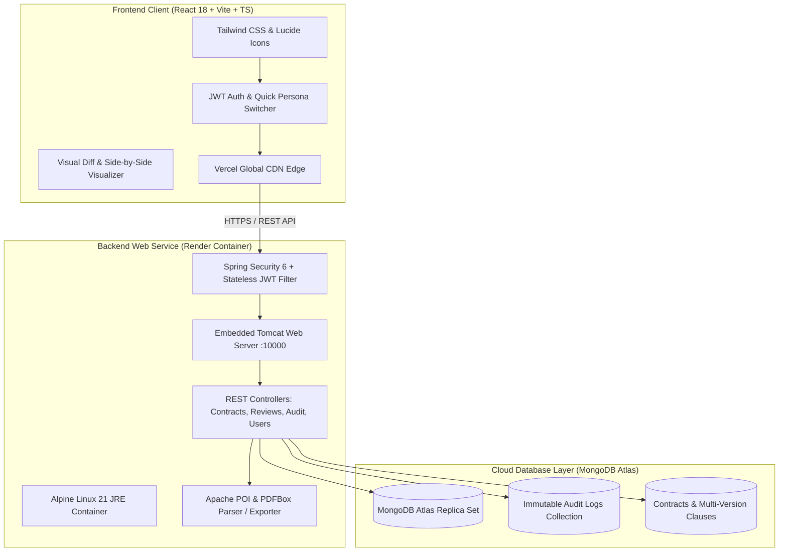

# ClauseTrail 📜⚖️
### Enterprise Legal Contract Lifecycle & Clause Modification System

[](https://clausetrail.vercel.app)
[](https://clausetrail-backend.onrender.com/api/health)
[](https://openjdk.org/)
[](https://spring.io/projects/spring-boot)
[](https://react.dev/)
[](https://www.typescriptlang.org/)
[](https://www.mongodb.com/cloud/atlas)
[](https://www.docker.com/)

---

## 📌 Executive Summary

**ClauseTrail** is an enterprise-grade Legal Document Lifecycle and Clause Modification platform designed to eliminate the chaos of managing commercial contracts across fragmented email threads, shared drives, and chaotic filename revisions (e.g. `Contract_v2_final_FINAL2.docx`).

ClauseTrail enables legal, procurement, and compliance departments to digitally ingest contracts, edit individual legal clauses with precision, visualize granular redline differences (word-by-word diffs), enforce rigorous multi-stage approval workflows, and maintain an immutable, tamper-proof audit trail for regulatory compliance.

---

## 🚀 Live Demo & Deployed Instances

| Service | Environment | Status | Endpoint / URL |
| :--- | :--- | :--- | :--- |
| **Frontend Web App** | Vercel (CDN Edge) |  | [clausetrail.vercel.app](https://clausetrail.vercel.app) *(or your Vercel deployment URL)* |
| **Backend REST API** | Render (Docker) |  | [clausetrail-backend.onrender.com](https://clausetrail-backend.onrender.com) |
| **API Health Check** | Render |  | [`GET /api/health`](https://clausetrail-backend.onrender.com/api/health) |

### ⚡ Instant Recruiter / Reviewer Access
The application comes pre-seeded with realistic enterprise contracts and personas. You can log in using either the credentials below or click the **1-Click Persona Switcher** inside the navbar:

| Persona | Role | Email | Password | Primary Permissions |
| :--- | :--- | :--- | :--- | :--- |
| **Eleanor Vance** | `ADMIN` | `admin@clausetrail.com` | `password123` | User/role management, audit logs, system-wide overrides |
| **Marcus Reed** | `EDITOR` | `editor@clausetrail.com` | `password123` | Contract upload, clause editing, submit modifications for review |
| **Sarah Jenkins** | `REVIEWER`| `reviewer@clausetrail.com`| `password123` | Review queue access, approve/reject changes with rationale |
| **David Kim** | `VIEWER` | `viewer@clausetrail.com` | `password123` | Read-only access to approved baseline contracts & history |

---

## 🏛️ System Architecture



---

## ✨ Key Capabilities & Engineering Highlights

### 1. Granular Clause-Level Version Control
Instead of treating contracts as monolithic binary blobs, ClauseTrail decomposes legal agreements into individual structured clauses. Users can modify specific terms (e.g. *Limitation of Liability*, *Data Privacy*, *SLA*) while keeping the rest of the document untouched.

### 2. Side-by-Side Visual Redline / Diff Engine
- Word-level and clause-level visual comparison highlighting **additions (green)**, **deletions (red)**, and **unchanged legal text**.
- Reviewers can instantly inspect what changed between version $N$ and version $N+1$ without manual document scanning.

### 3. Strict Multi-Stage Approval Workflow
- Lifecycle states: `DRAFT` ➔ `PENDING_REVIEW` ➔ `APPROVED` / `REJECTED`.
- Editors must specify a mandatory *Modification Reason* when proposing revisions.
- Reviewers have dedicated review queues with the ability to accept or reject with structured commentary.

### 4. Enterprise Role-Based Access Control (RBAC)
- Enforced at both the UI route level and backend API layer via Spring Security method annotations (`@PreAuthorize("hasRole('ADMIN')")`).
- Prevents unauthorized edits, rogue approvals, or unauthorized privilege elevation.

### 5. Immutable Regulatory Audit Trail
- Every single action (contract creation, clause update, review decision, role modification, authentication event) is recorded with timestamp, acting user metadata, IP address, and change payload.
- Provides compliance-ready audit reports exportable on demand.

### 6. Automated Document Parsing & Export
- **Apache POI**: Ingests `.docx` documents and extracts clauses automatically.
- **Apache PDFBox**: Generates professional PDF audit reports and version summaries on the fly.

---

## 🛠️ Technology Stack

### Frontend
- **Framework:** React 18 with TypeScript
- **Bundler & Tooling:** Vite (ultra-fast Hot Module Replacement & production bundle tree-shaking)
- **Styling:** Tailwind CSS (custom corporate design system, responsive layouts, dark/light modes)
- **Icons:** Lucide React
- **HTTP Client:** Axios with dynamic base URL support (`VITE_API_URL`)
- **Hosting:** Vercel with single-page-application (SPA) rewrite configuration and caching headers

### Backend
- **Language & Runtime:** Java 21 LTS (Modern syntax, pattern matching, virtual-thread capable)
- **Framework:** Spring Boot 3.3.3
- **Security:** Spring Security 6, JJWT (io.jsonwebtoken 0.12.6) for stateless JWT validation, BCrypt password hashing
- **Data Access:** Spring Data MongoDB with automated schema indexing and auditing (`@CreatedDate`, `@LastModifiedDate`)
- **Document Processing:** Apache PDFBox 3.0.3, Apache POI 5.3.0
- **Build Tool:** Maven 3.9 (Multi-stage container compilation)
- **Hosting:** Render Cloud (Docker containerized web service)

### Database
- **Provider:** MongoDB Atlas (M0 Free / M10+ Tier)
- **Topology:** 3-Node Cloud Replica Set with automated failover and TLS 1.3 encryption

---

## 📂 Repository Structure

```
ClauseTrail/
├── .github/                     # CI/CD workflows and repository configs
├── Backend/                     # Spring Boot 3.3.3 API Service
│   ├── Dockerfile               # Multi-stage Dockerfile (Maven 3.9 + Temurin JDK 21 -> JRE 21 Alpine)
│   ├── pom.xml                  # Maven project descriptor & dependencies
│   └── src/
│       └── main/
│           ├── java/com/clausetrail/
│           │   ├── config/      # SecurityConfig, JwtUtils, MongoConfig, GlobalExceptionHandler
│           │   ├── controller/  # Auth, Contract, Review, Audit, User, Health Controllers
│           │   ├── dto/         # Request/Response Data Transfer Objects
│           │   ├── model/       # Domain Models (Contract, ContractVersion, Clause, User, AuditLog)
│           │   ├── repository/  # Spring Data Mongo Repositories
│           │   └── service/     # Business logic, DiffService, ParserService, AuditService
│           └── resources/
│               └── application.yml  # Environment-variable driven configuration
├── Frontend/                    # React 18 + TypeScript + Vite SPA
│   ├── public/                  # Static assets & favicon
│   ├── src/
│   │   ├── api/                 # Axios client with interceptors
│   │   ├── components/          # Reusable UI components (DiffVisualizer, Navbar, Sidebar, etc.)
│   │   ├── context/             # AuthContext with 1-Click Persona Switcher
│   │   ├── types/               # TypeScript interfaces & domain models
│   │   └── views/               # Dashboard, ContractDetail, ReviewQueue, AuditLog, DiffComparison
│   ├── vercel.json              # Vercel SPA routing and security header configuration
│   └── package.json             # NPM dependencies & scripts
├── DEPLOYMENT.md                # Comprehensive deployment instructions (Render + Vercel)
├── PRD_Legal_Contract_...md     # Original Product Requirements Document
└── render.yaml                  # Render Infrastructure-as-Code Blueprint
```

---

## 🔒 Security & DevOps Best Practices

- **Zero Hardcoded Secrets:** All credentials (`MONGODB_URI`, `JWT_SECRET`, `PORT`, `CORS_ALLOWED_ORIGINS`) are externalized to environment variables.
- **Least-Privilege Container:** Docker container drops `root` permissions and runs under a dedicated `spring:spring` system user.
- **Container Memory Awareness:** JVM tuned with `-XX:+UseContainerSupport` and `-XX:MaxRAMPercentage=75.0` to respect cloud cgroup memory limits.
- **Strict CORS & Header Hardening:** Wildcard support for preview deployments (`https://*.vercel.app`) alongside `X-Frame-Options: DENY`, `X-Content-Type-Options: nosniff`, and `X-XSS-Protection: 1; mode=block`.

---

## 💻 Local Development Setup

### Prerequisites
- **JDK 21** or higher
- **Node.js 18+** & `npm`
- **Docker** (optional) or **MongoDB** (local or Atlas)

### 1. Clone the Repository
```bash
git clone https://github.com/PawanShigwan/ClauseTrail.git
cd ClauseTrail
```

### 2. Run the Backend
```bash
cd Backend
./mvnw spring-boot:run
```
*The backend starts at `http://localhost:8080`. Seed data and users are automatically initialized on first run.*

### 3. Run the Frontend
```bash
cd ../Frontend
npm install
npm run dev
```
*Open `http://localhost:5173` in your browser. The Vite development proxy automatically routes `/api` calls to `http://localhost:8080`.*

---

## 📡 Core API Endpoints

| Method | Endpoint | Access | Description |
| :--- | :--- | :--- | :--- |
| `POST` | `/api/auth/login` | Public | Authenticate user and receive JWT bearer token |
| `POST` | `/api/auth/register` | Public | Register a new user |
| `GET` | `/api/health` | Public | Service health check and uptime probe |
| `GET` | `/api/contracts` | Authenticated | List all contracts with status, version, and metadata |
| `POST` | `/api/contracts` | `EDITOR`, `ADMIN` | Create or upload a new contract |
| `POST` | `/api/contracts/{id}/modify` | `EDITOR`, `ADMIN` | Propose clause modifications (triggers new pending version) |
| `GET` | `/api/contracts/{id}/diff` | Authenticated | Generate side-by-side diff between two versions |
| `GET` | `/api/reviews/queue` | `REVIEWER`, `ADMIN` | Retrieve queue of contracts awaiting approval |
| `POST` | `/api/reviews/{id}/decision`| `REVIEWER`, `ADMIN` | Approve or reject a proposed contract revision |
| `GET` | `/api/audit` | `ADMIN` | Query immutable audit log stream with filtering |
| `GET` | `/api/users` | `ADMIN` | View and manage user accounts and system roles |

---

## 👤 Author & Contact

**Pawan Shigwan**  
- **GitHub:** [@PawanShigwan](https://github.com/PawanShigwan)  
- **Email:** [pawanshigwan990@gmail.com](mailto:pawanshigwan990@gmail.com)  
- **Repository:** [https://github.com/PawanShigwan/ClauseTrail](https://github.com/PawanShigwan/ClauseTrail)

---

*ClauseTrail was built with a relentless focus on clean architecture, enterprise domain modeling, type safety, and real-world compliance needs.*
